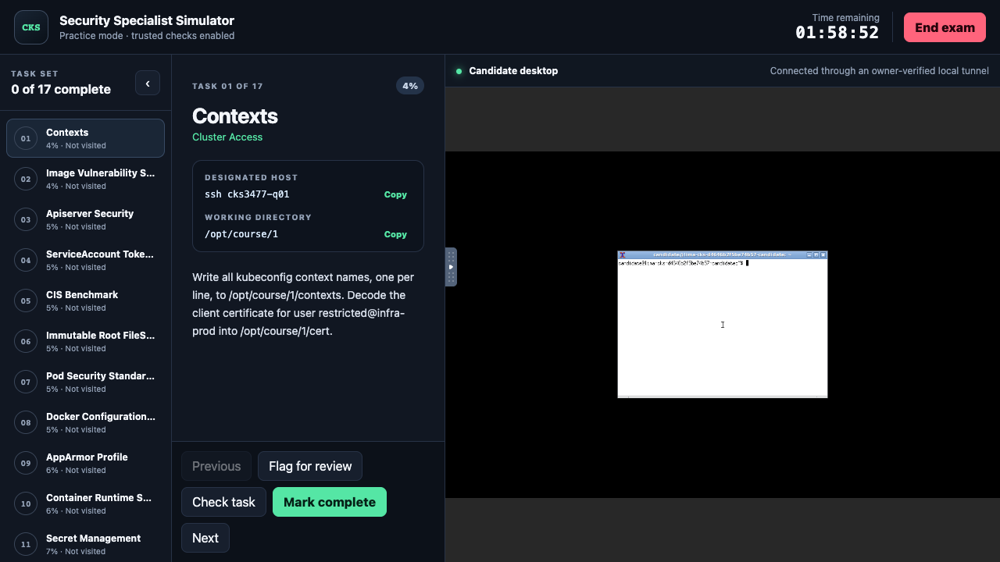
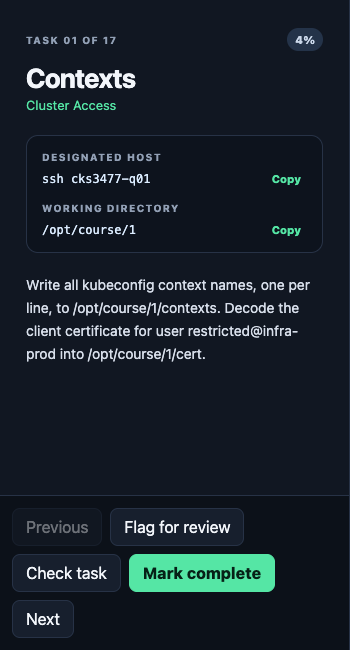

# CKS Simulator

`CKS-simulator` is a local Kubernetes security practice environment with two
explicit fidelity tiers:

- **Full (recommended):** four isolated Ubuntu ARM64 VMs on Apple Silicon: a
  candidate workstation plus one kubeadm control plane and two workers. It
  provides real systemd, containerd, Cilium, AppArmor, gVisor, Falco, ingress,
  audit logging, encryption at rest, Docker and node filesystems.
- **Quick:** a disposable three-node Kind cluster for fast API-object and
  artifact practice. It is useful, but it is not a machine-level CKS replica.

The lab provisions the environment and tools as IaC. The learner is tested on
security tasks, not on installing Kubernetes, Cilium, Falco, scanners or the
simulator itself.

## Install and start the full VM lab

The supported path installs every software prerequisite that the simulator can
safely own. It never requires Homebrew and never writes into `/usr/local`.

```sh
git clone https://github.com/thiago4go/CKS-simulator.git
cd CKS-simulator

./setup.sh --memory-profile low
./bin/cks-simulator exam start \
  --tier full \
  --memory-profile low \
  --name cks-simulator \
  --mode practice
```

The first command reuses Python 3.9+ when available or installs the pinned
Python 3.13.14 runtime under `.cks-tools/`, then installs the exact tested Lima
2.1.4 release in the same project-local directory. Downloads are bounded and
verified against committed SHA-256 digests. The second command provisions the
four Ubuntu VMs and installs Kubernetes, Cilium, Falco, scanners, the candidate
desktop and every exercise dependency as IaC.

| Requirement | Minimum | Handled automatically? |
|---|---:|---|
| Host | Apple Silicon macOS | No — physical compatibility constraint |
| CPU | 8 logical CPUs with `low` | No — physical capacity constraint |
| RAM | 12 GiB with `low` | No — physical capacity constraint |
| Free disk | 80 GiB | No — physical capacity constraint |
| Python | 3.9+ | Yes — compatible host Python is reused; otherwise pinned Python 3.13.14 is installed project-locally |
| Lima | 2.1.4 | Yes — installed project-locally with SHA-256 verification |
| Kubernetes and security tools | Pinned by `infra/versions.json` | Yes — installed inside the owned VMs during provisioning |
| Docker, Kind and host kubectl | Not required for the full tier | No installation needed |

The bootstrap relies only on the base macOS shell, `curl`, `tar`, `shasum` and
`awk`. CPU, RAM, disk, operating-system and architecture failures remain
explicit because package installation cannot repair physical host capacity.

### Interactive setup progress

On an interactive terminal, `provision`, `exam start`, and `exam resume` show
live setup progress instead of appearing to hang. The bar advances only when a
real lifecycle milestone has been verified; it is not a simulated time-based
percentage. Long-running checks keep updating the elapsed time and rotate short
CKS reminders about contexts, RBAC, `crictl`, kubelet logs, static Pods,
NetworkPolicies, AppArmor, and encryption at rest.

```text
CKS Simulator · preparing cks-simulator (low profile)
  First build can take tens of minutes; later runs reuse verified state.
  Creates 4 local Ubuntu VMs · 8 vCPUs · 5 GiB guest RAM.
  CKS tip: kubectl config get-contexts -o name lists every exam context before you change one.
✓ [██░░░░░░░░░░░░░░] 1/8 Host preflight · Host capacity and Lima verified · 00:00
⠹ [██████░░░░░░░░░░] 4/8 Kubernetes cluster · worker2: joining… · 2/4 · 07:31
```

The eight `exam start` stages are host preflight, Ubuntu VMs, base operating
systems, Kubernetes, security tooling, candidate workstation, the 17-task exam
baseline, and ExamUI. Provisioning alone uses the first six stages. Redirected
output stays clean automatically; use `--no-progress` to disable the display.

## Candidate workflow



The ExamUI opens on host loopback and keeps the exam workflow in one window:

1. Choose one of the 17 weighted tasks from the left rail.
2. Read the task, designated SSH alias and working directory in the centre.
3. Complete the task from the real candidate Linux desktop on the right.
4. In `practice` mode, use **Check task** for trusted live feedback.
5. Flag or mark tasks complete, then use **End exam** for one final 100-point grade.



The server owns the timer and progress state, so reloading the browser does not
reset the attempt. Final submission closes desktop access before grading.

## Resource profiles

Validated platform requirements:

- Apple Silicon macOS;
- at least 80 GiB free disk; and
- 16 logical CPUs and 16 GiB host RAM for the default `standard` profile, or
  8 logical CPUs and 12 GiB host RAM for `low`.

| Profile | Candidate CPU/RAM | Control plane CPU/RAM | Each worker CPU/RAM | Guest total | Status |
|---|---:|---:|---:|---:|---|
| `standard` | 2 / 2 GiB | 4 / 4 GiB | 3 / 2 GiB | 12 CPU / 10 GiB | Recommended default |
| `low` | 1 / 1 GiB | 3 / 2 GiB | 2 / 1 GiB | 8 CPU / 5 GiB | Validated resource-constrained option |

`low` uses exactly 50% of the default guest RAM and caps total guest CPU at
eight vCPUs. Current validation covered all 17 repeatable scenario grades and
restores on Build A, followed by ordinary destroy and an independent clean
Build B provision, replay, doctor and double-destroy. Neither build used swap
or logged an OOM kill. The 80 GiB disk reserve is more than four times the
measured 18.33 GiB complete-lab backing. `standard` remains recommended because
`low` has less scheduling and memory margin. The exact guest limits are fully
tested; the remaining evidence gap is one release run on a physical
eight-logical-CPU Mac rather than the 18-CPU validation host.

The command opens a host-loopback ExamUI with all 17 weighted tasks, a
server-authoritative timer, flag/complete navigation, designated-host SSH
aliases, working directories, and an embedded Linux desktop. The candidate
works in the desktop terminal; installing Kubernetes or security tools is not
part of the exercise. `practice` enables trusted per-task checks, while `exam`
hides interim results. Final submission closes desktop access before grading
and scores every task in one fixed 100-point denominator.

Closing the local UI bridge does not discard the attempt:

```sh
./bin/cks-simulator exam resume --tier full --name cks-simulator
./bin/cks-simulator exam status --tier full --name cks-simulator --json
./bin/cks-simulator exam teardown --tier full --name cks-simulator --force --json
```

The lower-level serial workflow remains available for focused study:

```sh
./bin/cks-simulator setup --tier full
./bin/cks-simulator doctor --tier full
./bin/cks-simulator provision --tier full --name cks-simulator
./bin/cks-simulator doctor --tier full --lab --name cks-simulator
./bin/cks-simulator shell --tier full --name cks-simulator

./bin/cks-simulator scenario prepare 09 --tier full --name cks-simulator
# Complete the task from the candidate workstation.
./bin/cks-simulator grade 09 --tier full --name cks-simulator --json
./bin/cks-simulator scenario restore 09 --tier full --name cks-simulator

./bin/cks-simulator delete --tier full --name cks-simulator
```

`./setup.sh` bootstraps Python before the Python CLI exists, delegates to
`setup --tier full`, installs Lima, and then runs the same host preflight as
`doctor`. Both layers are idempotent. Set `PYTHON=/absolute/path/to/python3` to
require a specific compatible interpreter, or set
`CKS_BOOTSTRAP_PREFER_PINNED=1` to use the committed project-local Python even
when a compatible system interpreter exists.

For a resource-constrained host, select `low` when creating the lab:

```sh
./bin/cks-simulator setup --tier full --memory-profile low
./bin/cks-simulator doctor --tier full --memory-profile low
./bin/cks-simulator provision --tier full --memory-profile low --name cks-low
```

The profile is bound immutably in lab state. Later `provision`, `doctor --lab`,
and `shell` commands infer it when the option is omitted; explicitly requesting
a different profile fails before guest mutation. Changing profile requires
destroying the lab and creating a new name. A `low` lab created before the
eight-vCPU contract was introduced must also be destroyed and recreated because
its immutable resource specification intentionally differs.

Scenario operations are serial. `prepare` creates an untouched zero-score
attempt and records an exact write-ahead recovery claim. `grade` is read-only,
uses root-owned observations and a least-privilege grader identity, and never
executes a learner-supplied script. `restore` returns the lab to a health-
attested baseline. Use a new lab name after deletion; destroyed state is kept as
an ownership tombstone and is never silently adopted.

The full release gate is destructive and normally takes about 65–80 minutes on the
validated host:

```sh
./bin/cks-simulator e2e \
  --tier full \
  --destroy-rebuild \
  --name my-release-check \
  --json
```

Build A runs the recovery rehearsal, all 17 serial scenario lifecycles, and the
combined exam lifecycle: 17 untouched `FAIL 0` grades, 17 reference `PASS 100`
grades, a fixed 100/100 receipt, and exact reverse teardown. It must be
destroyed and verified absent before Build B is provisioned independently from
IaC, replayed idempotently and destroyed. `--keep` is explicit and cannot be
combined with `--destroy-rebuild`.

## Quick Kind lab

The optional quick tier remains lightweight and requires Docker, kubectl and
Kind already installed on the host. `setup.sh` intentionally targets the
recommended full VM tier; Docker Desktop is a host application with separate
licensing and permissions and is not silently installed by this repository.

```sh
./bin/cks-simulator doctor
./bin/cks-simulator provision
./bin/cks-simulator list
./bin/cks-simulator scenario create 06 --apply
./bin/cks-simulator grade 06
./bin/cks-simulator e2e --json
./bin/cks-simulator delete
```

Quick-tier kubeconfig and scenario state remain under `.cks-state/`; the CLI
does not merge into `~/.kube/config`. Its release gate covers five safe live
fixtures and deterministic artifact grading for all 17 scenarios. Host-kernel,
runtime and static-pod claims belong only to the full tier.

## Safety and ownership

- VM names derive from a random lab UUID, not from a discoverable prefix.
- Every mutating operation verifies the provider handle and root-owned guest
  identity against immutable state.
- Candidate credentials are separate from operator and grader credentials.
- Guests have no host-directory mounts; temporary join material is revoked.
- Ordinary deletion uses only the exact recorded inventory. UUID-bound
  break-glass is explicit, and a release gate remains failed even if it is
  needed to finish cleanup.
- Private keys, kubeconfigs, downloaded binaries and generated lab state are
  never committed.

See [the runbook](docs/runbook.md), [architecture](docs/architecture.md), and
[compatibility contract](docs/compatibility.md) for operational detail. The
[eight-CPU validation receipt](docs/validation-2026-07-15-8cpu-low-profile.md)
records the complete resource and E2E evidence.
The [ExamUI combined-session receipt](docs/validation-2026-07-15-examui-low-profile.md)
records browser, grading, teardown, and clean-rebuild evidence.
The [public onboarding and bootstrap receipt](docs/validation-2026-07-16-onboarding-bootstrap.md)
records the pre-Python setup, real README captures, HTTPS guest provisioning,
and final clean-lab teardown evidence.

## Tests

```sh
python3 -m unittest discover -s tests -p 'test_*.py'
```

The offline suite uses dependency-injected providers and temporary state; it
does not require live VMs, Docker, Kind or kubectl. Live release evidence is
recorded separately under `docs/validation-*.md` and `docs/receipts/`.
