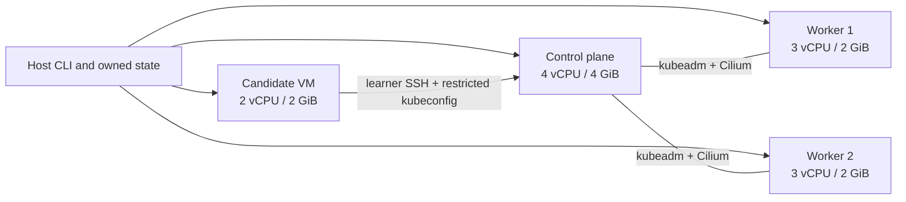
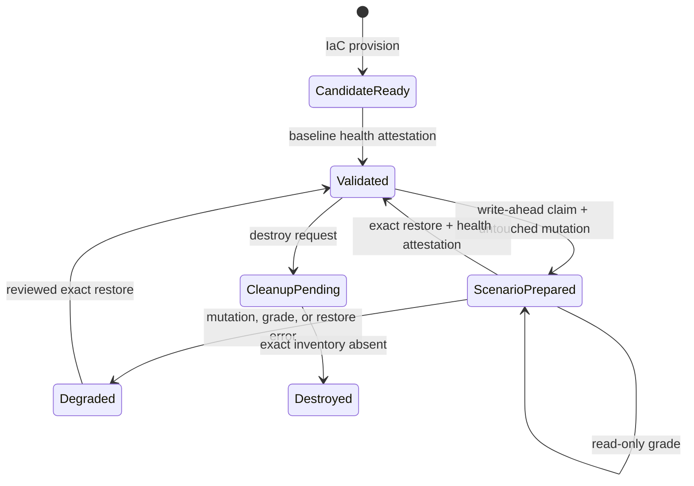

# Architecture

## Topology

The full tier runs four Lima `vz` guests on the `user-v2` network. Kubernetes
has exactly three kubeadm nodes; the candidate VM is deliberately outside the
cluster.

There are no host-directory mounts. Kubernetes uses containerd with systemd
cgroups. Docker exists only on worker 2 for scenario 08 and is verified not to
be the Kubernetes CRI. gVisor uses ARM64 `systrap`; Falco uses modern eBPF.

## Ownership model

The state store claims a random UUID before any VM creation and records the four
exact provider handles. Every ensure, command, observation and deletion checks
both the expected provider handle and a root-owned guest identity document.
Discovery that returns `UNKNOWN`, a missing identity, inventory drift or a
bundle digest mismatch fails closed.

Deletion never searches by prefix. Ordinary cleanup uses the immutable
inventory. Break-glass additionally requires the exact lab UUID and can target
only a bounded subset of those recorded handles.

## Trust separation

| Capability | Identity | Access |
|---|---|---|
| Infrastructure mutation | Host operator transport | Exact owned guests, root helpers |
| Learner work | `candidate` user and kubeconfig | Task-specific cluster and node access |
| Grade observation | `cks-grader` and root observer | Reviewed read-only probes and allowlisted resources |
| Grade evaluation | Pure Python evaluator | Immutable bounded snapshot; no I/O |
| Reference solution | Release gate only | Fixed reviewed mutation helper |

Observer scripts do not use `admin.conf` and cannot apply, create, patch,
delete, exec, proxy or impersonate. Cross-source evidence is required where a
candidate controls an artifact that could otherwise be forged.

## Scenario lifecycle

Untouched grading must be `FAIL 0`; reference grading must be repeatable
`PASS 100`. A restore fingerprint and full cluster-health fingerprint are
checked independently before another scenario can begin.

## Release proof

The full E2E gate creates two different UUID-owned builds. Build A performs
idempotent provisioning, an operator-transport recovery rehearsal and all 17
scenario lifecycles. Only after exact cleanup succeeds may Build B prove clean
IaC reprovision and idempotency. Both builds are destroyed in `finally`, and the
owner-only receipt records exact handles, cleanup mode and residual paths.
