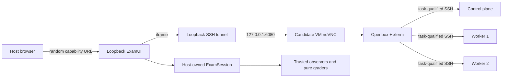
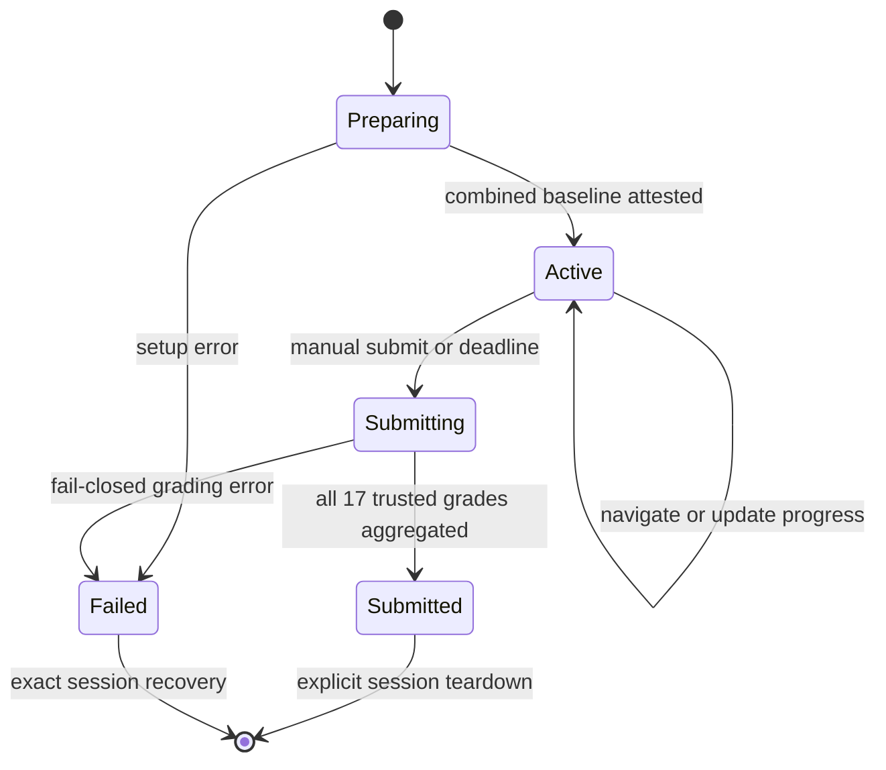

# Exam Session Architecture

Status: implemented and live-validated, 2026-07-15.

## Candidate experience

One command starts the owned VM lab and opens a loopback-only ExamUI. The
candidate sees the complete 17-task set, task weight, designated SSH host,
working directory, an authoritative two-hour countdown, and a persistent Linux
desktop. Moving between questions changes only the ExamUI view; work remains in
the same four VMs until final submission or teardown.

The candidate works from an xterm inside the candidate VM. Each task uses a
stable task-qualified alias such as `ssh cks3477-q17`, then the candidate works
in `/opt/course/17`. Vim and a lightweight documentation browser are available
inside the desktop. Practice mode permits trusted interim checks. Exam mode does
not reveal interim grades. Neither mode exposes reference solutions or operator
credentials.

Final submission first revokes the desktop tunnel, then collects trusted live
observations for every task. Every declared task remains in the 100-point
denominator, including incomplete or unvisited tasks. The first final receipt is
immutable and all duplicate submission requests return that receipt.

## Topology

The exam reuses the existing resource-constrained four-VM full lab; it does not
add a fifth VM or a browser container.

The ExamUI and SSH listener bind only to host `127.0.0.1`. TigerVNC and
websockify bind only to guest `127.0.0.1`. The tunnel target is derived from the
owned candidate provider handle; no browser field can select a host, port,
command, lab, task set, time, evidence, or score.

## State and authority

`ExamSession` is a separate, versioned host state contract. It does not weaken
the existing serial `ActiveScenario` contract. The immutable portion binds:

- lab UUID and frozen 17-task manifest;
- catalog and manifest digests;
- practice or exam mode;
- server start and deadline timestamps;
- one random attempt UUID per task.

The mutable portion contains only server-revisioned navigation flags and the
lifecycle state. State is atomically written to an owner-only file. The browser
receives candidate-safe task text and progress, but never the lab UUID, attempt
UUIDs, source digests, observation evidence, or grader invocation details.

The deadline is computed and enforced by the host. Browser time is only a
display projection. At the deadline, the same serialized submission path runs;
expiry and manual submission cannot create two terminal receipts.

## Combined baseline

The current single-scenario helpers cannot simply be run 17 times and left
active. The exam engine therefore owns one combined preparation and one exact
recovery boundary.

Fourteen tasks already use independent namespaces, objects, files, or node
configuration. Tasks 12, 14, and 17 all modify the kube-apiserver static pod and
must be composed into one deterministic manifest from three reviewed fragments:

- task 12: ImagePolicyWebhook flags, volume, and mount;
- task 14: encryption-provider flag, volume, and mount;
- task 17: audit flags, volume, and mount.

Preparation captures one untouched manifest fingerprint before guest mutation.
Recovery restores that single baseline, never a per-task backup. All task claims
are written before mutation. Task-qualified SSH aliases avoid the incompatible
legacy aliases that point at different roles for different scenarios.

## Scoring contract

Final scoring accepts only the frozen manifest and one trusted `LiveGrade` per
declared task. It rejects missing identity bindings, duplicates, unknown tasks,
and forged mappings. Missing or failed tasks score zero while remaining in the
denominator. `LAB_TAMPERED` and `LAB_BROKEN` take precedence over numeric score.
The receipt includes a canonical digest and is stored before it is rendered.

The default pass threshold is 67/100. This is a simulator policy, not a claim
about the Linux Foundation's undisclosed live-exam passing score.

## Recovery and release gates

Final submission prevents further candidate mutation before observation. A
failed preparation or grading attempt remains recoverable through the same
owned inventory and immutable baseline claims. Teardown is idempotent and may
delete only the four exact provider handles already owned by the lab UUID.

Release requires all of the following evidence:

1. Offline state, API, security, aggregation, provisioning, and tunnel tests.
2. Browser navigation, reload, practice/exam separation, expiry, duplicate
   submit, desktop revocation, and hostile-client tests.
3. A live low-profile run with all 17 tasks prepared concurrently, no OOM or
   swap, and no non-loopback desktop listeners.
4. A candidate-path run across at least two designated hosts followed by one
   trusted final receipt.
5. Untouched `FAIL 0`, reference `PASS 100`, candidate-forged evidence `FAIL`,
   exact destroy, clean IaC rebuild, and a second exact destroy.

The live combined-baseline, browser, resource, exact-teardown, and clean-IaC
rebuild gates passed on the low profile. See
[the validation receipt](validation-2026-07-15-examui-low-profile.md).
