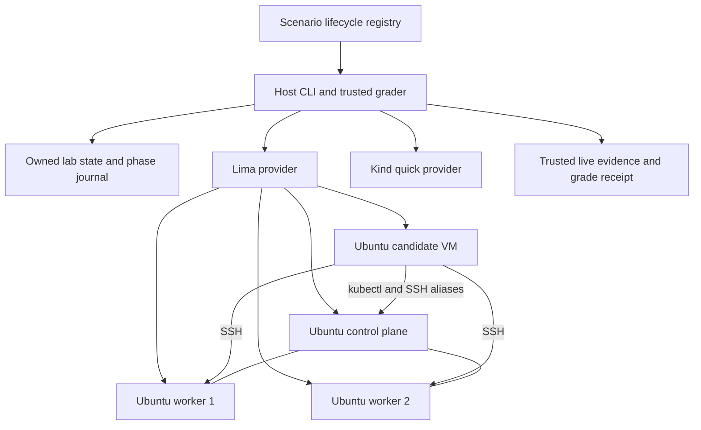
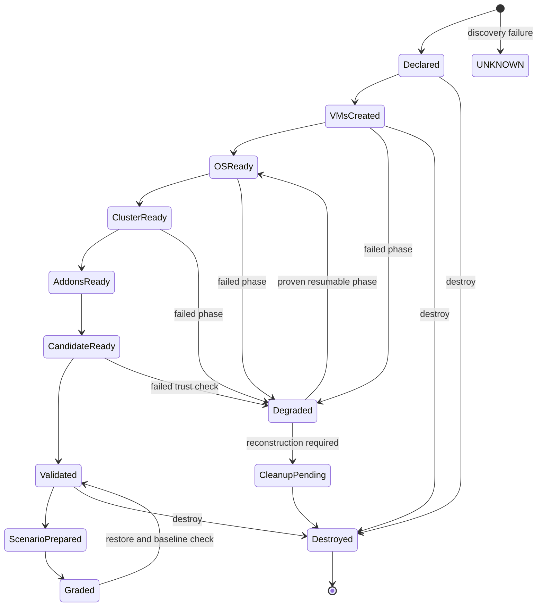
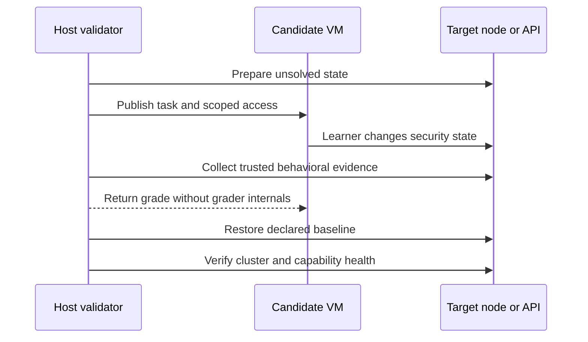

# Full VM CKS Lab - Plan

## Goal Capsule

- **Objective:** Deliver a reproducible Ubuntu VM-based CKS simulator that provisions the tools before practice, runs every scenario against real cluster or host behavior, and proves clean destruction and recreation from IaC.
- **Authority:** The user's requirement for a proper pre-provisioned CKS environment overrides the current Kind-only compatibility boundary; the supplied Kubernetes 1.35 simulator brief remains the scenario source.
- **Execution profile:** Deep, security-sensitive infrastructure work with a capability spike before broad scenario conversion.
- **Stop conditions:** Stop only for a confirmed upstream ARM64/kernel incompatibility, a tool's lack of Kubernetes 1.35 support that fails behavioral validation, or a required scope change that would make the lab materially different.
- **Tail ownership:** The implementation owns review, live validation, destruction, second clean rebuild, validation receipt, and atomic commits.

---

## Product Contract

### Summary

Add a full tier built from four Lima-managed Ubuntu VMs: an unprivileged candidate workstation plus one kubeadm control plane and two workers. IaC installs and configures the platform; the learner is assessed on securing, auditing, detecting, and repairing it, not on installing the lab.

### Problem Frame

The Kind quick tier is reliable for Kubernetes API exercises but shares Docker Desktop's Linux VM kernel and hides the systemd, kernel, runtime, and node-filesystem surfaces required by much of CKS. Ten catalogued scenarios therefore cannot currently be validated live, and artifact substring checks cannot establish that AppArmor, gVisor, Falco, Cilium, audit, encryption, kube-bench, or daemon changes function.

The simulator needs a Linux exam terminal and real Ubuntu nodes while remaining safe to destroy, restore, and reproduce on the user's Apple Silicon Mac. The current checkout also contains completed but uncommitted Kind grading and E2E work, so that checkpoint must be preserved before provider restructuring begins.

### Actors

- A1. **Learner:** enters the candidate VM, reads tasks, uses preinstalled tools, SSHes to target aliases, and submits or checks work.
- A2. **Operator:** invokes host-side lifecycle, recovery, validation, and destruction commands.
- A3. **Release validator:** runs reference solutions and failure cases through the trusted grading boundary without exposing those mechanics to the candidate VM.

### Requirements

**Infrastructure and toolchain**

- R1. One host-side command provisions an Ubuntu candidate VM and a three-node kubeadm Kubernetes 1.35 cluster from version-controlled IaC.
- R2. The baseline uses native ARM64 Lima VZ guests on a private mutually reachable network with no host-directory mounts into security-sensitive paths.
- R3. Provisioning installs Kubernetes, containerd, Cilium, AppArmor support, gVisor, Falco, Trivy, kube-bench, Docker Engine, ingress, OpenSSL, SSH, and scenario prerequisites before learner access.
- R4. Tool and image versions are centralized and pinned; generated credentials, kubeconfigs, keys, VM disks, logs, and learner state remain untracked with restrictive permissions.
- R5. Host preflight checks CPU, memory, disk, Lima/VZ/ARM64, networking, routes, and required assets without mutating the lab.

**Learner experience and scenarios**

- R6. The candidate VM provides a Linux exam terminal, isolated kubeconfigs, original target aliases, task files, and scoped SSH access without mounting the host home, Docker socket, SSH agent, grader, or operator credentials.
- R7. Installation and cluster bootstrap never appear as learner tasks; scenario starting states remain intentionally unsolved.
- R8. Every catalogued scenario implements a live `prepare -> grade -> restore -> baseline health` lifecycle in the full tier.
- R9. Only one scenario may be active in a lab by default, and a second scenario refuses to prepare until the first is restored.
- R10. Control-plane-breaking scenarios use a recovery ladder of Kubernetes API, operator transport, then owned reconstruction; loss of SSH or guest networking is never represented as a repairable API-only failure.

**Grading and lifecycle safety**

- R11. Full-tier grading uses operator-controlled probes and cross-source evidence, declares the trust model for every criterion, and never passes solely on mutable guest-reported output; learner-authored artifacts are supplemental evidence only.
- R12. Grade results distinguish `PASS`, `PARTIAL`, `FAIL`, `LAB_TAMPERED`, and `LAB_BROKEN`, remain read-only and repeatable, and support equivalent human and JSON output.
- R13. Every mutating lifecycle operation is serialized per lab and requires matching ownership metadata; discovery failures are not interpreted as confirmed absence.
- R14. Provisioning is resumable across recorded phases, ordinary start preserves state, targeted restore repairs bounded scenario mutations, and rebuild recreates drifted or broken infrastructure from IaC.
- R15. Destruction is idempotent, refuses unowned Lima instances, runs time- and size-bounded diagnostics that cannot block cleanup, and verifies that no owned instances or state claims remain.

**Validation and compatibility**

- R16. The Kind quick tier remains available with its current API-level scoring and is clearly separated from authoritative full-tier results.
- R17. Offline unit tests cover provider, state, scenario, grading, and command behavior without needing Lima or a running cluster.
- R18. The full release gate provisions from clean state, validates installed capabilities behaviorally, exercises all scenario lifecycles, destroys the lab, provisions it again from IaC, revalidates health, and destroys it again.
- R19. Release claims report exact coverage and upstream support caveats; no missing scenario or capability may silently shrink a score denominator.

### Key Flows

- F1. **Fresh provision:** Operator preflights the host, claims a lab identity, creates four VMs, configures the operating systems, bootstraps kubeadm and addons, configures candidate access, and receives a validated ready inventory.
- F2. **Practice:** Learner prepares one scenario, enters the candidate VM, works on the named target, requests a trusted grade, and restores the baseline before moving to another scenario.
- F3. **Recovery ladder:** A destructive scenario breaks the API server or node service; the operator tries the Kubernetes API, then Lima's operator transport, and records `LAB_BROKEN` or `LAB_TAMPERED` before owned reconstruction when management access or baseline integrity is lost.
- F4. **Release validation:** Validator starts from no owned VMs, proves provision and idempotent start, behaviorally validates capabilities and all scenario lifecycles, destroys everything, repeats a clean provision and health gate, then performs final destruction.

### Acceptance Examples

- AE1. Given no owned Lima instances, when full provision completes, then four healthy VMs exist, exactly three Kubernetes nodes are Ready, and every required tool passes a behavioral probe.
- AE2. Given an untouched prepared scenario, when it is graded, then it does not pass; when a controlled reference solution is applied, it passes; when restored, the baseline health fingerprint returns.
- AE3. Given provisioning stopped after any recorded phase, when provision is repeated, then it resumes or reports a precise recoverable error without deleting unowned resources.
- AE4. Given a broken kube-apiserver static Pod, when restore runs, then recovery proceeds over Lima access without requiring `kubectl` and the API health gate returns.
- AE5. Given an unmanaged Lima instance with a colliding name, when provision or destroy runs, then it refuses mutation and preserves the instance.
- AE6. Given a completed full release gate, when the final inventory is inspected, then no owned VM, claim, kubeconfig, or temporary credential remains and the validation receipt records both successful builds.

### Success Criteria

- Full-tier provision and health validation succeed on the user's Apple Silicon Mac within the declared 12-vCPU and 18-24-GiB guest budget.
- All 17 scenarios are included in the live denominator and satisfy untouched-fail, reference-pass, restore-clean acceptance.
- One two-build release gate passes: Build A exercises all 17 scenarios, while Build B proves clean IaC reprovision, capabilities, baseline health and cleanup.
- The Kind quick tier's 21 offline tests and 15-gate live test remain green after provider extraction.

### Scope Boundaries

#### Included

- Local macOS Apple Silicon execution through Lima.
- One non-HA control plane and two workers; the candidate workstation is not a cluster node.
- Original simulator aliases mapped onto the four-machine inventory.
- Behavioral grading and deterministic recovery for all supplied scenarios.

#### Deferred to Follow-Up Work

- A fully air-gapped artifact mirror and offline VM rebuild.
- Linux-host VM providers equivalent to Lima.
- Additional CKS question sets beyond the supplied 17-scenario brief.

#### Outside this Product's Identity

- Teaching Kubernetes, Cilium, Falco, gVisor, or Docker installation.
- Production high availability, cloud deployment, multi-tenant isolation, or certification-exam proctoring.
- Pretending an upstream-unsupported tool/version combination is supported merely because installation completed.

---

## Planning Contract

### Key Technical Decisions

- KTD1. **Preserve two explicit tiers.** `quick` remains Kind-based and fast; `full` is the authoritative VM tier. Shared catalog concepts prevent duplicated product behavior while provider-specific lifecycle and grading remain separate.
- KTD2. **Use four native ARM64 Lima VZ guests on one `user-v2` network.** Guest DNS supplies VM-to-VM reachability without privileged `socket_vmnet`; host orchestration uses `limactl shell` and `limactl copy` because the Mac cannot directly route to those guest addresses.
- KTD3. **Use Lima YAML and idempotent guest provisioning as IaC.** Terraform would only wrap local CLI calls without adding a useful declarative provider. Cross-node kubeadm orchestration remains in a host-side reconciler because Lima provision steps are per-VM and may run on every boot.
- KTD4. **Pin Kubernetes 1.35.6 and system containerd 2.x with systemd cgroups.** Lima's bundled containerd is disabled for cluster nodes; Docker is installed only for its standalone exercise and never becomes the Kubernetes CRI.
- KTD5. **Gate Cilium before broad implementation.** Cilium 1.19.5's published matrix stops at Kubernetes 1.34. The full tier may proceed on Kubernetes 1.35 only if ARM64 installation, datapath, DNS, ingress, and policy enforcement pass; otherwise the conflict is an upstream blocker, not a silent downgrade.
- KTD6. **Use gVisor `systrap` and Falco modern eBPF on ARM64.** Nested KVM is unnecessary. Both require executable smoke tests before their scenarios are marked live.
- KTD7. **Keep candidate and operator trust boundaries separate.** The candidate receives task material, candidate kubeconfig, and node SSH access but never the host project mount, operator keys, grader implementation, reference solutions, or ownership metadata.
- KTD8. **Make the catalog declare per-tier lifecycle handlers, not shell strings.** Python dispatch selects reviewed handlers; catalog data maps target roles, prerequisites, and grader criteria without becoming a command-injection surface.
- KTD9. **Use trusted live evidence as the full-tier score.** Existing artifact grading remains useful in quick/offline mode, while full graders prove behavior and classify infrastructure failure separately from learner failure.
- KTD10. **Prefer reconstruction over complicated undo.** Targeted restores are used only for bounded, tested scenario mutations; provider or baseline drift triggers a complete owned-lab rebuild from IaC.
- KTD11. **Treat grading as tamper-evident, not anti-cheat.** The threat model covers ordinary learner work and accidental or externally observable drift, not a malicious local user defeating the simulator. Each criterion declares its operator-controlled anchor, learner-controlled surfaces, anti-spoof check and `LAB_TAMPERED` condition; evidence invalidated by root access requires rebuild rather than a passing grade.
- KTD12. **Use immutable lab identity, not names, as destruction authority.** A write-ahead lab UUID records exact provider handles and matching guest identity; reconciliation fails closed on disagreement, never adopts automatically, and keeps quick/full state namespaces separate.
- KTD13. **Centralize typed local and remote execution.** Lab names, aliases and paths are validated; subprocesses use fixed executables with argv/stdin parameterization; remote operations do not interpolate learner-controlled shell text; logs are redacted and size-bounded.
- KTD14. **Authenticate privileged dependencies and expire bootstrap secrets.** Image checksums, repository keys and released artifacts are verified before mutation; host-operator, learner SSH, learner kubeconfig and bootstrap credentials have separate scopes and lifecycles; join tokens are revoked after use.
- KTD15. **Keep full tier opt-in at the CLI.** Omitting `--tier` preserves the current quick-tier commands, state paths, outputs and exit codes; full-tier lifecycle is selected explicitly.

### Assumptions

- Lima 2.1.4 remains installable through Homebrew and its VZ/user-v2 behavior matches its release documentation; the user has authorized the host-level installation for this execution.
- Ubuntu 24.04 ARM64 enables AppArmor and exposes the BTF/eBPF capabilities Falco modern eBPF needs under VZ.
- gVisor's ARM64 `systrap` platform functions inside the selected Ubuntu guest and containerd version.
- Cilium 1.19.5 may function on Kubernetes 1.35 despite the current support-matrix gap; this remains untrusted until the capability spike passes.
- Scenario preparation may remap the supplied target alias to the required inventory role because only one scenario is active; the mapping must preserve each scenario's host, runtime and control-plane semantics.

### Resource Profile

| Machine | vCPU | Memory | Sparse disk | Primary role |
|---|---:|---:|---:|---|
| Candidate | 2 | 4 GiB | 30 GiB | Linux exam terminal and scanning tools |
| Control plane | 4 | 8 GiB | 50 GiB | kubeadm control plane, etcd and static-Pod work |
| Worker 1 | 3 | 6 GiB | 40 GiB | AppArmor, gVisor, Falco and workloads |
| Worker 2 | 3 | 6 GiB | 40 GiB | Docker exercise, Falco and workloads |

Preflight requires at least 16 host CPUs, 40 GiB host RAM and 200 GiB free disk, preserving approximately 16 GiB host memory headroom on the validated machine. Disks are sparse, but the gate reserves growth allowance before creating VMs.

### Scenario Target Mapping

| Source target | Scenario IDs | Prepared role |
|---|---|---|
| `cks3477` | 01, 17 | Candidate context fixture for 01; control plane for 17 |
| `cks8930` | 02, 03, 13 | Candidate scanner for 02; control plane for 03 and 13 |
| `cks5608` | 04, 07, 16 | Worker 1 and cluster API |
| `cks2546` | 06, 11, 15 | Worker 2 and cluster API |
| `cks7262` | 05, 09, 10, 14 | Control plane for 05 and 14; Worker 1 for 09 and 10 |
| `cks4024` | 08, 12 | Worker 2 for Docker; control plane for webhook |

The active scenario rewrites only its candidate SSH alias mapping; restore removes it and verifies the next scenario receives the declared role.

### Scenario Recovery Matrix

| Scenario IDs | Mutation class | Recovery contract |
|---|---|---|
| 01, 02 | Candidate-only files and scan artifacts | Replace the owned fixture directory atomically, then revalidate candidate access and cluster health |
| 04, 06, 07, 11, 13, 15 | Kubernetes API resources | Apply the reviewed baseline through operator credentials, verify object state and rerun cluster/addon probes |
| 03, 12, 14, 17 | Control-plane configuration or static Pods | Restore through Lima operator transport while the API may be unavailable; rebuild the lab if transport, identity or baseline attestation fails |
| 05 | Node CIS configuration | Restore reviewed node files and services, then verify kubelet/runtime/cluster health; reconstruct the node on undeclared drift |
| 08 | Docker daemon and container behavior | Restore daemon configuration, restart Docker, remove exercise containers and rerun Docker plus Cilium connectivity probes |
| 09 | AppArmor profile and workload | Remove the exercise workload, restore or unload only the owned profile, and prove both denial and cluster health baselines |
| 10 | gVisor runtime and workload | Remove owned RuntimeClass/workloads, restore the reviewed runtime configuration and rerun native plus `systrap` probes |
| 16 | Falco rules and service state | Restore the owned rule fragment and service configuration, restart Falco, and prove a fresh positive/negative event pair |

Lima snapshot support is not a release dependency. Recovery uses explicit targeted restores where the matrix permits them and otherwise destroys only the exact recorded provider handles before reconstructing from IaC.

### High-Level Technical Design







### Output Structure

```text
cks_simulator/
  providers/
    base.py
    kind.py
    lima.py
  state.py
  lab.py
  scenarios.py
  live_grading.py
infra/
  versions.json
  lima/
    candidate.yaml
    control-plane.yaml
    worker.yaml
  provision/
    common/
    candidate/
    control-plane/
    worker/
scenarios/
  fixtures/<id>/
  handlers/<id>.py
tests/
  test_state.py
  test_lima_provider.py
  test_scenario_lifecycle.py
  e2e/
```

### Sequencing

The current Kind grading/E2E changes land first as an independent checkpoint. A disposable spike with its own minimal write-ahead claim then proves Lima networking and the high-risk ARM64 security stack before production provider abstractions are designed. Recovery primitives and an API-down canary land with the scenario engine before any control-plane scenario. Release documentation follows the authoritative two-build receipt.

### System-Wide Impact

- **Trust:** Learners are expected to become root on lab nodes, so guest logs, binaries and services are not inherently trusted evidence. Per-criterion trust declarations, operator-controlled inputs and cross-source checks make grading tamper-evident; malicious anti-cheat resistance is out of scope.
- **Lifecycle:** Quick and full providers share commands but not state, ownership, inventory or score claims. A provider discovery error propagates as lifecycle state `UNKNOWN`; an attempted grade without established infrastructure health emits `LAB_BROKEN`, never absence or learner failure.
- **Networking:** Each lab uses explicit zero mounts and disabled or allowlisted port forwarding. Required peer/dependency traffic is allowlisted and negative probes check host-control services and unrelated Lima guests; shared Lima resources are protected by a host-wide lock.
- **Credentials:** Operator transport, learner SSH, learner kubeconfig and bootstrap credentials are separate. Diagnostics, journals, process output and receipts are treated as potential disclosure surfaces.
- **Recovery:** `kubeadm reset` is not considered convergence because it leaves CNI and network state. Every phase has a predicate and a declared resume-or-rebuild result.

### Risks and Dependencies

- **Cilium 1.19.5 on Kubernetes 1.35:** Official pages disagree on support. Mitigation: require full connectivity and policy tests; a failure stops full-tier claims without downgrading Kubernetes silently.
- **kube-bench on Kubernetes 1.35:** Version 0.15.6 has no 1.35 mapping. Mitigation: expose it as training-only CIS evidence and never label it authoritative 1.35 compliance.
- **ARM64 kernel integration:** Falco modern eBPF, AppArmor and gVisor may reveal VZ-specific limits. Mitigation: run positive and negative capability probes before scenario work and retain their receipt.
- **Lima address and transport drift:** user-v2 addresses are not hard-static and management uses SSH-based transport. Mitigation: verify recorded identities and IPs at start; rebuild on address or management-transport loss.
- **Learner tampering:** Root access can forge evidence or disable recovery. Mitigation: attest probes, detect undeclared drift, classify tampering separately and rebuild instead of trusting guest-local claims.
- **Supply-chain mutation:** Provisioning installs privileged components from external repositories. Mitigation: pin and verify image/artifact identity, fail before mutation on integrity errors, and redact all short-lived credentials.
- **Diagnostics from hostile guests:** Device files, FIFOs, symlinks or unbounded output can stall cleanup. Mitigation: diagnostics are best-effort with deadlines, byte limits, no-follow/type checks, isolated destinations and control-character sanitization; cleanup always continues.

---

## Implementation Units

| Unit | Title | Primary files | Depends on |
|---|---|---|---|
| U1 | Preserve the Kind release checkpoint | Existing CLI, grading, fixtures, tests, validation doc | None |
| U2 | Prove ARM64 VM capabilities | Disposable `infra/spike/` assets and capability receipt | U1 |
| U3 | Extract provider-neutral state and lifecycle | `cks_simulator/providers/`, `state.py`, CLI tests | U1, U2 |
| U4 | Provision four VMs and kubeadm cluster | `infra/lima/`, `infra/provision/`, Lima provider | U2, U3 |
| U5 | Build candidate and toolchain boundary | Candidate provisioning, inventory, doctor and shell | U4 |
| U6 | Add scenario lifecycle and trusted grading | Catalog, scenario engine, live grading | U3, U5 |
| U7 | Convert scenarios 01-08 | Scenario handlers, fixtures and tests | U6 |
| U8 | Convert scenarios 09-17 | Scenario handlers, fixtures and tests | U6 |
| U9 | Add the full release gate | Fault rehearsal, diagnostics, full E2E | U7, U8 |
| U10 | Validate two clean builds and document release | README, runbook, validation receipt | U9 |

### U1. Preserve the Kind release checkpoint

- **Goal:** Reconcile the current staged and unstaged grading/E2E work, rerun its offline and live gates, and commit it before restructuring overlapping modules.
- **Requirements:** R16, R17, R19.
- **Files:** `README.md`, `cks_simulator/cli.py`, `cks_simulator/grading.py`, `scenarios/fixtures/`, `tests/test_cli.py`, `docs/validation-2026-07-14.md`.
- **Approach:** Keep the validated 21-test and 15-gate quick-tier behavior intact and establish a clean comparison point for later provider extraction.
- **Test scenarios:** Offline suite passes; disposable three-node Kind E2E passes and cleans up; no private key is tracked; validation counts match the receipt.
- **Verification:** The project worktree is clean after an atomic quick-tier commit.

### U2. Prove ARM64 VM capabilities

- **Goal:** Establish a minimal four-VM Lima topology and prove the kernel/runtime capabilities that determine whether the full design is viable.
- **Requirements:** R1-R5, R18-R19.
- **Files:** `infra/versions.json`, `infra/spike/`, `scripts/validate-full-capabilities`, `docs/compatibility.md`.
- **Approach:** Use disposable script-level IaC with a unique write-ahead claim and explicit collision refusal; pin and authenticate Lima, Ubuntu, Kubernetes, containerd and addon artifacts; validate user-v2 networking, kubeadm 1.35.6, Cilium traffic policy, AppArmor denial, gVisor execution, Falco event capture, Docker daemon behavior, Trivy scan, kube-bench and ingress TLS. Retain only the receipt and validated interface requirements; U3-U10 are gated on success.
- **Test scenarios:** Each capability has a positive functional probe and a deliberately broken negative probe; Cilium must enforce traffic on 1.35; integrity failure stops before VM mutation; collision preserves existing VMs; failed probes produce redacted diagnostics and the disposable instances are removed.
- **Verification:** A dated capability receipt records versions, architecture, kernel, commands and pass/fail results without secrets or unsupported claims.

### U3. Extract provider-neutral state and lifecycle

- **Goal:** Separate CLI routing, ownership/state, and Kind/Lima behavior without regressing the quick tier.
- **Requirements:** R12-R17.
- **Files:** `cks_simulator/cli.py`, `cks_simulator/providers/base.py`, `cks_simulator/providers/kind.py`, `cks_simulator/providers/lima.py`, `cks_simulator/state.py`, `cks_simulator/e2e.py`, `tests/test_cli.py`, `tests/test_state.py`, `tests/test_lima_provider.py`.
- **Approach:** Model lab inventory separately from Kubernetes nodes, write immutable identity before creation, reconcile exact provider handles and guest identity, centralize typed process execution, persist an atomic phase journal, serialize mutators per lab, retain fail-closed tri-state discovery, and preserve omitted-`--tier` quick behavior.
- **Test scenarios:** Quick commands retain behavior; forged, copied or missing state refuses mutation; lookalike unmanaged names survive; unknown discovery refuses deletion; concurrent mutators serialize; metacharacters, newlines, leading dashes, hostile paths and oversized output cannot alter command structure; JSON and human errors agree.
- **Verification:** All provider/state tests run without Docker or Lima, and the existing Kind live gate still passes.

### U4. Provision four VMs and the kubeadm cluster

- **Goal:** Reconcile four owned Ubuntu instances into a validated candidate-plus-three-node topology.
- **Requirements:** R1-R5, R13-R15.
- **Files:** `infra/lima/`, `infra/provision/common/`, `infra/provision/control-plane/`, `infra/provision/worker/`, `cks_simulator/providers/lima.py`, `cks_simulator/lab.py`.
- **Approach:** Use idempotent guest provisioning, host-ordered kubeadm reconciliation, stable instance DNS, recorded node IP checks, cgroup v2, disabled swap, required modules/sysctls/ports, unique MAC/product UUID, explicit CRI socket, non-overlapping CIDRs, system containerd with systemd cgroups and a single Cilium CNI.
- **Test scenarios:** Fresh provision; repeated provision; interrupted phase resume; VM stop/start; cgroup-v1, swap, port, forwarding, CRI and CIDR negative cases; node IP drift; duplicate identity refusal; exactly three Ready nodes; CoreDNS and Cilium health; destroy twice; unmanaged instance preservation.
- **Verification:** The lifecycle reaches `addons-ready`; final `validated` is reserved for candidate and trust-boundary checks. Owned destroy confirms provider discovery succeeded and no exact recorded handle remains.

### U5. Build the candidate and toolchain boundary

- **Goal:** Present a Linux exam workstation with every required tool while preserving the operator/learner trust boundary.
- **Requirements:** R3-R7, R10-R12.
- **Files:** `infra/provision/candidate/`, `infra/inventory.json`, `cks_simulator/lab.py`, `cks_simulator/cli.py`, `tests/test_lima_provider.py`.
- **Approach:** Generate separate ephemeral learner and bootstrap credentials, map original aliases to inventory roles, copy a candidate-scoped kubeconfig and tasks, install tools without solved policies, disable unintended mounts/forwarding, and keep operator grading/reference material host-side.
- **Test scenarios:** Candidate can resolve and SSH to every alias; kubectl reaches the cluster; required tools execute; candidate cannot read host mounts, operator state, grader code or reference solutions; canary secrets never appear in logs, receipts, process arguments or candidate disks; private key modes are restrictive and bootstrap credentials are removed.
- **Verification:** `doctor --tier full --lab` behaviorally validates the candidate and every node capability.

### U6. Add scenario lifecycle and trusted grading

- **Goal:** Replace full-tier fixture special cases with a catalog-driven, reviewed lifecycle and live-evidence grading engine.
- **Requirements:** R8-R14, R19.
- **Files:** `scenarios/catalog.json`, `cks_simulator/scenarios.py`, `cks_simulator/live_grading.py`, `scenarios/handlers/`, `tests/test_scenario_lifecycle.py`, `tests/test_live_grading.py`.
- **Approach:** Declare tier support, target role, prerequisites, recovery class and handler identity in data; implement prepare/grade/restore plus the recovery ladder in Python handlers; add an operator-only reference-solution registry with timeouts and cleanup; keep commands static and reviewed; preserve artifact scoring as supplemental quick-tier evidence.
- **Test scenarios:** The expected set freezes at IDs 01-17; missing, skipped, timed-out, broken or restore-mismatched handlers stay in the denominator and fail release; untouched baseline fails; partial evidence scores partially; no criterion passes solely on guest-controlled output; probe spoofing or undeclared drift reports `LAB_TAMPERED`; API-down recovery succeeds, while SSH/firewall/key loss forces rebuild; grade is read-only; restore returns the health fingerprint.
- **Verification:** Offline contract tests prove every catalog ID has complete full-tier lifecycle metadata and safe dispatch.

### U7. Convert scenarios 01-08

- **Goal:** Implement live lifecycle and behavioral grading for contexts, scanning, API exposure, projected tokens, CIS, immutable filesystems, Pod Security Admission, and Docker configuration.
- **Requirements:** R7-R12, R19.
- **Files:** `scenarios/fixtures/01/` through `scenarios/fixtures/08/`, corresponding `scenarios/handlers/`, scenario tests.
- **Approach:** Seed deterministic unsolved state, validate real kubeconfig/certificate output, pin vulnerability inputs, inspect live API/static Pod state, execute kube-bench, verify filesystem writes and admission warnings, and test Docker daemon/container behavior.
- **Test scenarios:** Each scenario covers untouched fail, incorrect fail or partial, reference pass, repeated read-only grade, restore clean, and next-scenario preparation.
- **Verification:** Scenarios 01-08 pass the full lifecycle matrix serially on the VM lab.

### U8. Convert scenarios 09-17

- **Goal:** Implement live lifecycle and behavioral grading for AppArmor, gVisor, secrets, image webhook, Cilium policy, etcd encryption, ingress TLS, Falco, and audit policy.
- **Requirements:** R7-R12, R19.
- **Files:** `scenarios/fixtures/09/` through `scenarios/fixtures/17/`, corresponding `scenarios/handlers/`, scenario tests.
- **Approach:** Validate actual profile denial, runtime evidence, secret consumption, webhook denial, network reachability, raw etcd ciphertext, HTTPS routing, kernel event detection, and generated audit events; use out-of-band recovery for static-Pod changes.
- **Test scenarios:** Each scenario covers untouched fail, incorrect fail or partial, reference pass, repeated read-only grade, restore clean, and post-restore cluster/addon health; control-plane failures remain recoverable without Kubernetes API access.
- **Verification:** Scenarios 09-17 pass the full lifecycle matrix serially on the VM lab.

### U9. Add the full release gate

- **Goal:** Implement and rehearse release proof across all lifecycle phases, faults, scenarios, diagnostics, cleanup and rebuild.
- **Requirements:** R13-R19.
- **Files:** `cks_simulator/e2e.py`, `cks_simulator/recovery.py`, `tests/e2e/`, `bin/cks-simulator`.
- **Approach:** Use a unique owned lab, verify idempotency and capabilities, execute every scenario lifecycle with controlled reference solutions, rehearse the recovery ladder, inject representative provisioning/control-plane failures, destroy and inspect for orphans, rebuild once more, revalidate and destroy in `finally`. A break-glass cleanup may use only the write-ahead lab UUID and exact recorded provider handles; it never discovers by prefix or adopts resources.
- **Test scenarios:** Failure at every phase produces redacted diagnostics; cleanup-only failure is visible; exactly 17 lifecycle records are attempted and pass; second build uses only IaC; discovery failure reports `UNKNOWN`; final inspection checks exact VM handles, disks, claims, locks, journals, kubeconfigs, SSH keys and temporary credentials; `--keep` is explicit and safe.
- **Verification:** A rehearsed machine-readable gate can produce both builds, all capability gates, 17/17 lifecycle results and provable cleanup.

### U10. Validate two clean builds and document release

- **Goal:** Make the operational contract reproducible for the user and future agents.
- **Requirements:** R1-R19.
- **Files:** `README.md`, `CONTRIBUTING.md`, `docs/architecture.md`, `docs/runbook.md`, `docs/compatibility.md`, `docs/validation-2026-07-14-vm.md`.
- **Approach:** Execute the sole authoritative release receipt, with Build A running all 17 lifecycles and Build B proving clean IaC reprovision, capabilities, baseline health and cleanup; document resource requirements, tier semantics, tool pins, recovery, expected duration and support caveats.
- **Test scenarios:** A fresh reader can run host preflight, provision, enter candidate, practise, grade, restore, destroy, and rebuild using documented commands; receipts match actual counts and no unsupported claim remains.
- **Verification:** Documentation review, security/code review, final test suite, final full E2E, clean project status, and atomic commits complete the release.

---

## Verification Contract

| Gate | Command or action | Applies to | Done signal |
|---|---|---|---|
| Offline regression | `python3 -m unittest discover -s tests -v` | Every implementation unit | All tests pass without live infrastructure |
| Syntax and data | `python3 -m compileall cks_simulator tests`, `bash -n` over provision scripts, `jq empty` over JSON | Changed Python, shell and JSON | No syntax or schema failures |
| Secret scan | Search tracked files for private keys, kubeconfigs and generated credentials | Every commit | No generated secret material is tracked |
| Quick-tier live gate | `CKS_KIND_USE_GLOBAL=0 ./bin/cks-simulator e2e --tier quick` | U3 and release | Existing Kind gate remains 100/100 and cleans up |
| Capability gate | `./bin/cks-simulator doctor --tier full --lab --json` | U2, U4, U5 | All required tools pass behavioral probes |
| Scenario matrix | Full-tier E2E lifecycle for the frozen set of catalog IDs 01-17 | U7-U9 | Exactly 17 attempted and 17 passing records; untouched fail, reference pass and restore clean for every ID |
| Rebuild gate | `./bin/cks-simulator e2e --tier full --destroy-rebuild --json` | U9-U10 | Two clean provisions validate and both cleanups leave no orphans |
| Review gate | Compound Engineering simplification and multi-persona code/security review | U10 | No validated P0/P1 findings remain |

---

## Definition of Done

- The Kind grading/E2E checkpoint is committed and remains green.
- Lima is installed at the pinned supported version and host preflight passes on the user's Mac.
- Four owned Ubuntu ARM64 VMs are reproducibly created with the documented resource budget.
- Kubernetes 1.35.6 has one Ready control plane, two Ready workers, working DNS, Cilium, ingress and system containerd.
- AppArmor, gVisor, Falco, Trivy, kube-bench and Docker pass behavioral capability checks rather than package-presence checks.
- The candidate VM exposes the exam workflow without exposing operator or host trust material.
- Every scenario ID 01-17 has complete full-tier prepare, trusted grade, restore and baseline-health behavior.
- Full grades distinguish learner failure from broken infrastructure and have JSON parity.
- `UNKNOWN` is only a lifecycle/discovery state; an attempted grade that cannot establish infrastructure health emits `LAB_BROKEN`, never an additional grade enum.
- Ownership, phase journaling, locking, diagnostics, recovery and idempotent destruction are covered by offline and live failure tests.
- A clean release run provisions, validates, destroys, provisions again solely from IaC, revalidates and destroys again.
- The final validation receipt states exact versions, coverage, timing, resource usage and any upstream support caveat.
- Generated state, credentials, dead-end experiments, obsolete special cases and abandoned approaches are absent from the final diff.
- Project changes are reviewed, tested, documented, committed atomically in the nearest repository, and the command-center coordination record is updated.

---

## Appendix

### Sources and Research

- [Lima user-v2 networking](https://lima-vm.io/docs/config/network/user-v2/) establishes guest-to-guest DNS and host routing limits.
- [Lima VZ configuration](https://lima-vm.io/docs/config/vmtype/vz/) establishes native Apple Silicon constraints and VM-type immutability.
- [Lima mount behavior](https://lima-vm.io/docs/config/mount/) supports the no-host-mount security boundary.
- [Kubernetes kubeadm installation](https://v1-35.docs.kubernetes.io/docs/setup/production-environment/tools/kubeadm/install-kubeadm/) defines node prerequisites and exact 1.35 installation guidance.
- [Kubernetes container runtimes](https://v1-35.docs.kubernetes.io/docs/setup/production-environment/container-runtimes/) defines CRI and cgroup-driver requirements.
- [Cilium Kubernetes requirements](https://docs.cilium.io/en/stable/network/kubernetes/requirements/) supplies the current support-matrix caveat.
- [Kubernetes AppArmor tutorial](https://kubernetes.io/docs/tutorials/security/apparmor/) defines kernel, runtime and profile prerequisites.
- [gVisor platforms](https://gvisor.dev/docs/user_guide/platforms/) supports the ARM64 `systrap` choice.
- [Falco package installation](https://falco.org/docs/setup/packages/) supports AArch64 and the modern eBPF driver path.
- [kube-bench](https://github.com/aquasecurity/kube-bench) defines benchmark/tool version evidence requirements.
- kube-bench 0.15.6 has no Kubernetes 1.35 benchmark mapping, so its CIS output is training evidence only until upstream publishes an explicit 1.35 mapping.
